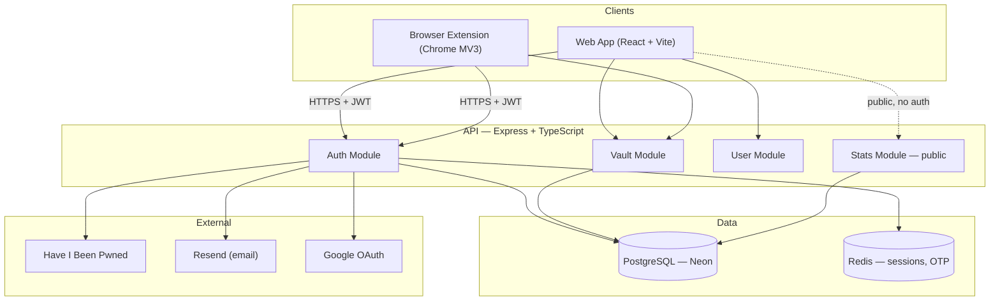
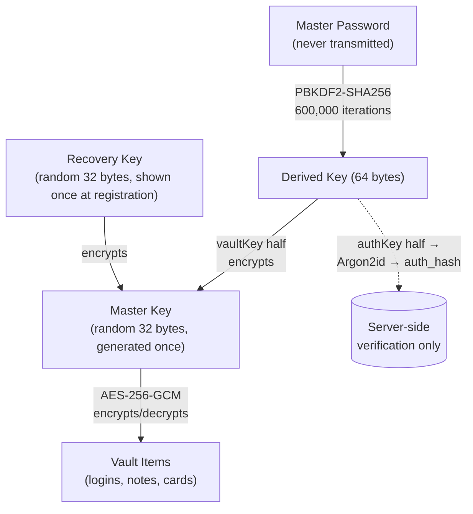
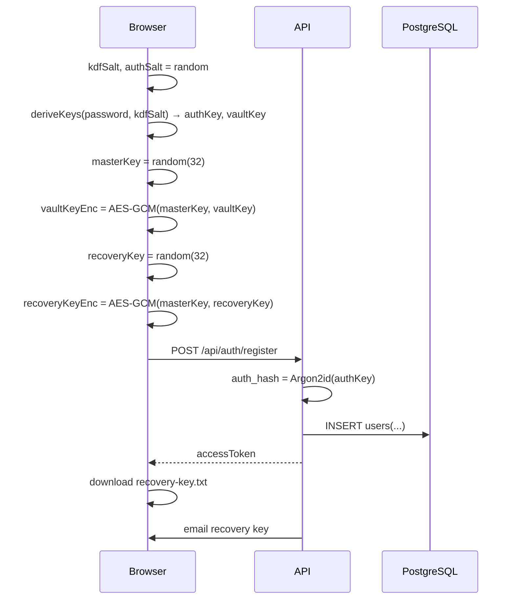
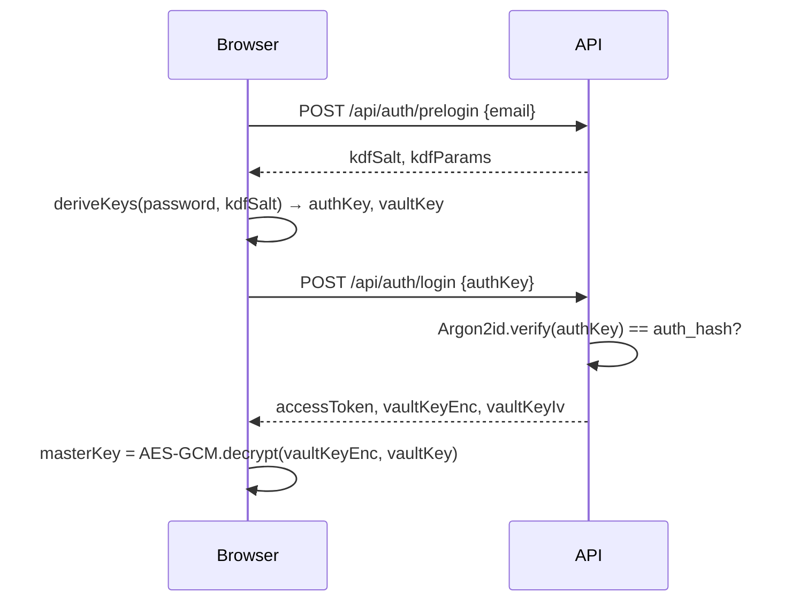
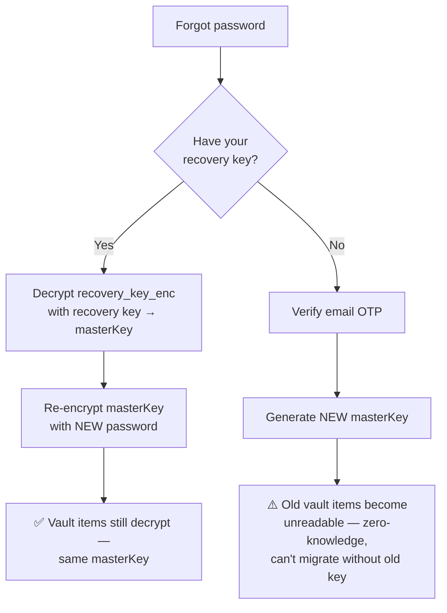
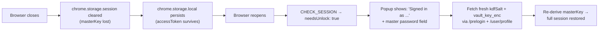

# 🔐 VaultX — Your Privacy-First Identity Vault

<p>
  
  
  
</p>

> Privacy-first hybrid identity vault exploring zero-knowledge encryption,
> offline-first architecture, secure sync systems, and cross-platform
> password management.

**Repo:** <https://github.com/jayesh-thar/vaultx>

VaultX is your single secure vault for everything sensitive — login credentials, secure notes, and payment cards. Remember just **one master password** to access everything, and a separate **PIN** to unlock your saved cards. Use it from anywhere: log in to the web app directly, or install the browser extension to automatically save new credentials as you sign up and register around the web, and autofill them the next time you need them. The server never sees a single unencrypted item — everything is encrypted and decrypted in your browser using the Web Crypto API.

> ⚠️ **Public Beta**: VaultX is functional and the encryption model is solid,
> but this is an early release. Expect rough edges, and please report bugs —
> see [Roadmap & Feedback](#roadmap--feedback) below.

---

## Table of Contents

1. [What VaultX Does](#what-vaultx-does)
2. [Architecture Overview](#architecture-overview)
3. [The Zero-Knowledge Key Hierarchy](#the-zero-knowledge-key-hierarchy)
4. [Core Flows](#core-flows)
5. [Monorepo Structure & Per-App Docs](#monorepo-structure--per-app-docs)
6. [Feature List](#feature-list)
7. [Tech Stack](#tech-stack)
8. [Getting Started](#getting-started)
9. [Security Model](#security-model)
10. [Roadmap & Feedback](#roadmap--feedback)
11. [Contributing](#contributing)
12. [License](#license)

---

## What VaultX Does

VaultX stores your logins, secure notes, and payment cards — encrypted on
your device before they're ever sent anywhere. Three pieces work together:

- **Web App** — your vault's home base. Add and manage logins, secure
  notes, and payment cards; run breach health checks; export/import data;
  manage account security and recovery.
- **Browser Extension** — once installed, VaultX works in the background as
  you browse: it automatically detects and saves new login forms AND card
  details (number, expiry, CVV) as you enter them, then autofills them the
  next time you visit. Cards stay behind a separate PIN.
- **API** — stores only encrypted blobs and keys, manages sessions, sends
  emails (OTP, recovery key, security notifications), and checks passwords
  against breach databases without ever seeing them.

---

## Architecture Overview



The server is a thin, mostly-dumb storage and coordination layer. All the
"interesting" logic — encryption, decryption, key derivation, recovery —
happens client-side.

---

## The Zero-Knowledge Key Hierarchy

Three keys, three jobs:



| Key                              | Generated                           | Stored where                                                           | Purpose                                                                                               |
| -------------------------------- | ----------------------------------- | ---------------------------------------------------------------------- | ----------------------------------------------------------------------------------------------------- |
| Master Password                  | By you, memorized                   | Nowhere                                                                | Unlocks everything                                                                                    |
| Derived Key (authKey + vaultKey) | PBKDF2 from password + salt         | Never stored                                                           | `authKey` verifies login (hashed again server-side with Argon2id); `vaultKey` decrypts the Master Key |
| Master Key                       | Random, at registration             | Encrypted twice in DB (`vault_key_enc`, `recovery_key_enc`)            | Directly encrypts every vault item                                                                    |
| Recovery Key                     | Random, at registration, shown once | Never stored — only its _encrypted form_ (`recovery_key_enc`) is in DB | Lets you reset your password **without losing your vault**                                            |

**Why AES-GCM doubles as a correctness check**: AES-GCM includes an
authentication tag. Decrypting with the wrong key doesn't return garbage — it
**throws**. So "is this recovery key correct?" is answered by "did the
decrypt succeed?" — no separate verification step needed.

---

## Core Flows

### Registration



### Login



### Forgot Password — two paths



### Extension Re-Unlock (browser restart)



---

## Monorepo Structure & Per-App Docs

```
pm/
├── apps/
│   ├── api/           → see apps/api/README.md
│   ├── web/            → see apps/web/README.md
│   └── extensions/      → see apps/extensions/README.md
├── README.md             (this file)
└── CONTRIBUTING.md
```

| App                                 | Docs                                                                                                     |
| ----------------------------------- | -------------------------------------------------------------------------------------------------------- |
| **API** (Express, Postgres, Redis)  | [`apps/api/README.md`](apps/api/README.md) — endpoint reference, schema, env vars                        |
| **Web App** (React, Vite, Tailwind) | [`apps/web/README.md`](apps/web/README.md) — pages, crypto reference, session model                      |
| **Browser Extension** (Chrome MV3)  | [`apps/extensions/README.md`](apps/extensions/README.md) — message architecture, content script behavior |

---

## Feature List

### Vault

- Logins, secure notes, payment cards
- Custom fields on any item
- Favorites, categories, search/filter
- CSV import (Chrome, Firefox, Bitwarden, 1Password, LastPass formats)
- Encrypted JSON export/backup
- One-time share links

### Security

- AES-256-GCM client-side encryption
- PBKDF2-SHA256, 600,000 iterations
- Argon2id server-side hash (defense in depth)
- Recovery key (vault-preserving password reset)
- Email OTP for sensitive actions (password change, card PIN reset)
- Vault Health dashboard — breach (HIBP k-anonymity), weak, reused, old
  password detection
- Built-in TOTP (2FA code generation) for saved accounts
- Session management — view & revoke active sessions
- PIN-protected payment cards (separate from master password)

### Auth

- Email + master password
- Google OAuth (web)
- Password change (OTP-gated, re-encrypts vault key only — vault data
  untouched)

### Browser Extension

- Autofill suggestions on matching sites
- Automatic credential capture on form submit (with failed-login detection)
- Pending-save banner with 10-minute window
- Re-unlock after browser restart (no full re-login)
- Card PIN gate with 5-minute auto-relock

### Beta

- Public landing page with live, anonymized vault statistics
- Beta badge across the app

---

## Tech Stack

| Layer     | Choice                                       |
| --------- | -------------------------------------------- |
| Backend   | Node.js, Express, TypeScript                 |
| Database  | PostgreSQL (Neon), Knex (migrations only)    |
| Cache     | Redis                                        |
| Frontend  | React 18, Vite, TypeScript, Tailwind CSS     |
| State     | Zustand (in-memory session state)            |
| Extension | Chrome MV3, service worker + content scripts |
| Auth      | JWT (access + rotating refresh), Argon2id    |
| Crypto    | Web Crypto API — AES-256-GCM, PBKDF2-SHA256  |
| Email     | Resend                                       |
| Breach DB | Have I Been Pwned (k-anonymity range API)    |

---

## Getting Started

```bash
git clone https://github.com/jayesh-thar/vaultx.git
cd vaultx
npm install

# Configure environment — see apps/api/README.md and apps/web/README.md
cp apps/api/.env.example apps/api/.env
cp apps/web/.env.example apps/web/.env

cd apps/api && npm run migrate

# 3 terminals:
cd apps/api && npm run dev          # http://localhost:5000
cd apps/web && npm run dev          # http://localhost:5173
cd apps/extensions && npm run build # then load dist/ via chrome://extensions
```

---

## Security Model

- **Zero-knowledge**: the server stores only ciphertext (`encrypted_data`,
  `iv`) and doubly-encrypted keys (`vault_key_enc`, `recovery_key_enc`). It
  cannot decrypt vault contents under any circumstance — not with database
  access, not with source code access.
- **Defense in depth**: the client-derived `authKey` is hashed again with
  Argon2id before storage, so a database leak alone doesn't give an attacker
  anything directly crackable against the original password.
- **Refresh token rotation**: reuse of a stale refresh token (a sign of
  token theft) immediately invalidates **all** sessions for that user.
- **Rate limiting** on login, registration, and refresh endpoints.
- **HIBP breach checks** use k-anonymity — only the first 5 hex characters of
  a SHA-1 hash are ever sent, so HIBP never sees your actual password.

---

## Roadmap & Feedback

VaultX is under active development. Planned next:

- 🖥️ **Desktop app** (Tauri/Electron) — same zero-knowledge vault, native
  experience, offline-first with background sync
- 🐛 **In-app bug & feature report form** — submit feedback without leaving
  VaultX (coming soon)
- 📱 Mobile app
- 🔄 Cross-device sync improvements / conflict resolution
- 🌐 Firefox extension support
- 🏢 Shared vaults / team folders

Found a bug or have a suggestion **right now**? Please
[open an issue on GitHub](https://github.com/jayesh-thar/vaultx/issues) —
beta feedback directly shapes what gets built next.

---

## Contributing

See [`CONTRIBUTING.md`](CONTRIBUTING.md) for setup, workflow, code style, and
the manual test checklist (no automated test suite yet — contributions
welcome here too!).

---

## License

MIT — see `LICENSE`.

---

<p align="center">Built with care for privacy. 🔐</p>
